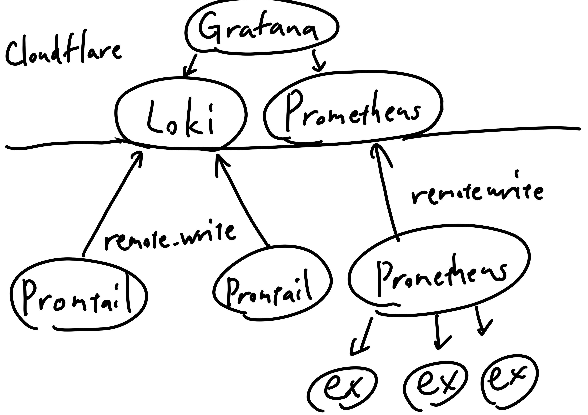
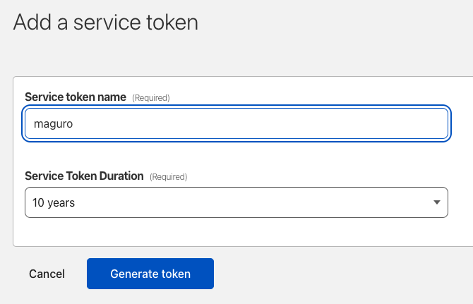
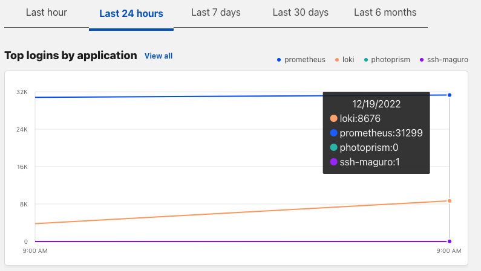

# Cloudflareを酷使してメトリクス集める話

天久保 Advent Calendar 2022 によって生えた記事
[https://adventar.org/calendars/8233](https://adventar.org/calendars/8233)

## 経緯
録画鯖や「目にした画像全部落とすくん」などを動かすために手元でサーバーを運用する機会が多くて、 Grafana Loki や Prometheus を各拠点で立てていたんですが拠点が死ぬとメトリクス全てにアクセスできなくなって困っていた。

## どうしたい
それぞれの拠点の Prometheus,Loki に VPN 越しでアクセスするのをやめて


Prometheus,Loki を Grafana に寄せてトークン付きのリクエストで書き込むようにする。



## どうやるか
遠隔書き込みだけであれば Prometheus や Loki には remote_write 用の API が生えていて、 Prometheus や Promtail などの設定に記述することで実現することができる。

```yaml
# prometheus.yml
global:
  external_labels:
    provider: unique_name

remote_write:
  - url: https://prometheus.kakikomisaki/api/v1/write
```

```yaml
# promtail/config.yml
clients:
  - url: https://loki.kakikomisaki/loki/api/v1/push
    external_labels:
      provider: unique_name
```

これだけでもいいんですが、知らん人に書き込まれたくないじゃないですか。どうすればええねん。認証認可とかだるすぎるって。

### Cloudflareくんの登場！
Cloudflare には Zero Trust という認証認可とかを全部請け負ってくれるくんがいるんです。ここで勘のいい人はドメインが必要なことに気づいたはずです、
早く買ってきてください。


まず Cloudflare Zero Trust 上で Secret を作成します。サイドタブ？の Access/Service Auth を押してもらって、Service Token タブで Create Service Token を押します。有効期限は一応つけておきましょう。



Generate token ボタンを押すとリクエストのヘッダーにとして使える Client ID と Client Secret の組が表示されます。ここでしか表示されないので確実にメモっておきましょう。

次に書き込み先とするドメインについてのルールを設定していきます。サイドタブの Access/Applications を押してもらって、Add an application しちゃいます。Self-hosted を選んで書き込み先としたいドメインを入力していきます。


認証についてのオプションがあってコンソールなどにメール認証とか Google 認証でアクセスできるようにもできますが、今回はスコープから外します、のでこのまま次に進みます。

今回の目的でもあるアクセスする際のポリシーについての設定が出てくるので、ここで先程作成した Service Token を Allow として設定します。


残りの設定についてはおまかせします。

### 公開する

ここまでの作業が終わっているなら設定したドメインを用いてサーバーを公開しても自由にアクセスされることはありません(たぶん)。Argo Tunnel とかを使って書き込み先となるメインの Prometheus と Loki を外部から見えるようにします。
(もちろん通常のDNSレコードを用いた公開方法でも問題ありませんが、Cloudflare の DNS レコードを用いる必要があるかつ Proxied である必要があります)


### 各拠点の Prometheus や Promtail をわからせる

Prometheus の remote_write 設定は簡単にできて、`remote_write.headers` 以下にメモった Client ID と Client Secret を書くだけです。

```yaml
# prometheus.yml

remote_write:
  - url: https://prometheus.kakikomisaki/api/v1/write
    remote_timeout: 20s
    headers:
      CF-Access-Client-Id: "client id dayo"
      CF-Access-Client-Secret: "client secret dayo"
```

Promtail くんにはまだヘッダを設定するオプションが存在しないため、筆者は
[https://github.com/grafana/loki/issues/7470](https://github.com/grafana/loki/issues/7470)
に付随するブランチをビルド(cyanolupus/promtail:customheaders)して動かしています。
その場合は以下のように設定します。

```yaml
# promtail/config.yml

clients:
  - url: https://loki.kakikomisaki/loki/api/v1/push
    custom_headers:
      CF-Access-Client-Id: "client id dayo"
      CF-Access-Client-Secret: "client secret dayo"
```

## おわりや

以上の手順で私は幸せになりました。あなたも幸せになりましょう。




