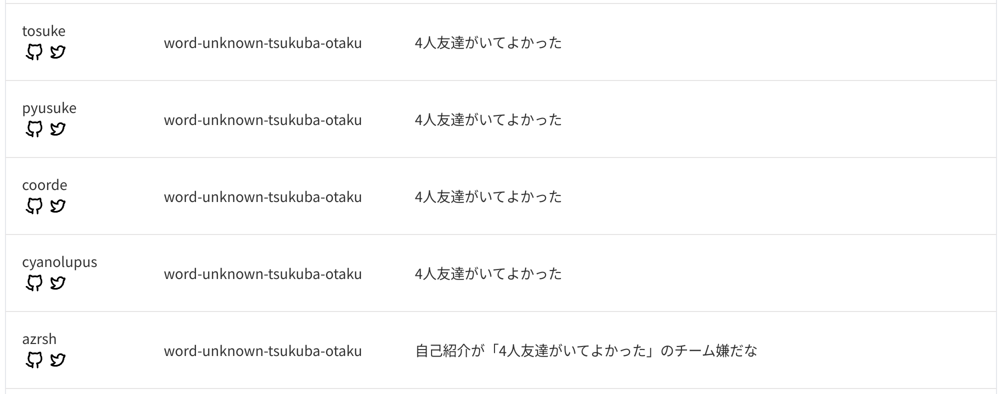

# ICTSC2022 に参加しました

tosukeくんが誘ったあざらしくんにいきなり誘われて、ICTSC2022 に参加しました。

## 参加メンバー

- cyanolupus (https://twitter.com/cyanolupus)
- coord-e (https://twitter.com/coord_e)
- tosuke (https://twitter.com/t0suk3)
- azarashi2931 (https://twitter.com/azarashi_uni)
- public_yusuke (https://twitter.com/public_yusuke)

この 5 人でチーム word-unknown-tsukuba-otaku として参加しました。

## 当日まで

当日がいつか把握していなかったので当日を意識できていませんでした。

## 解いたやつ

生粋の Linux ガキ (ネットワークはわからない) としてはシェルをいじるような問題でお茶を濁すことでチームに貢献しました。

- ajl: protocが... 見つからない!? (300)
- lty: やらかしたかもしれない... (100)
- cfb: ストレージ消し飛んだ... (200)

## 解答を見ていくやつ


### ajl: protocが... 見つからない!?

この問題は Dockerfile を書いて alpine のよく知られた問題としての glibc と musl libc の互換性のなさを埋めつつ不足バイナリを足すやつでした。

`protoc` が `PATH` に存在するのに `/bin/sh: protoc: not found` となって動かないので gcompat と libstdc++ と libgcc を入れてやることで glibc への依存を誤魔化して `go` からバイナリを適当に落としてきた。（経緯: 実際 debian をベースイメージにしてみるとコンパイルまで通るのでそれでいいなと思った）（てかビルドしたくなくね？w）

```diff
--- builder/Dockerfile.bkup     2023-03-04 12:14:37.336263829 +0900
+++ builder/Dockerfile  2023-03-04 14:14:21.871430982 +0900
@@ -6,6 +6,12 @@
   wget -q "https://github.com/protocolbuffers/protobuf/releases/download/v22.0/protoc-22.0-linux-x86_64.zip" -O "protobuf.zip" && \
   unzip -o protobuf.zip -d protobuf && chmod -R 755 protobuf/*

+RUN GOBIN=/download/gobin go install google.golang.org/protobuf/cmd/protoc-gen-go@v1.28 && \
+  GOBIN=/download/gobin go install google.golang.org/grpc/cmd/protoc-gen-go-grpc@v1.2
+
 FROM golang:1.20.1-alpine AS builder

+RUN apk add --no-cache gcompat libstdc++ libgcc
+
 COPY --from=dl /download/protobuf/bin /usr/local/bin/
+COPY --from=dl /download/gobin /usr/local/bin/
```


### lty: やらかしたかもしれない...

簡単で root ユーザーとして rbash から bash に chsh してやる。


### cfb: ストレージ消し飛んだ...

`zfs send` で出力したデータを `unpigz` で圧縮して `openssl enc` で暗号化したものを `{}.enc` として保存していたのでその逆をやれば良くて、適当にやって `zfs recv` で受け取ってやれば良い。一応スナップショットが残っていたりすると衝突エラーが出るので予め消す必要がある。

```shell
#!/bin/bash

function decode() {
    cat $1 | openssl enc -iter 100 -aes-256-cbc -d -k ictsc2022 | unpigz -c
}

zfs destroy -r zpool

for i in $(ls $1 -1); do
    decode $1/$i | zfs recv zpool -F
done
```

## 応援

シェル芸問題を消費してしまったあとは過度な並列化によって仕事がなくなってしまったので、ランキング表を目`watch`して盛り上げたり、「応援」していました。

## 感想

- 仲間のおかげで優勝まで連れて行ってもらって本当に4人友達がいてよかったなと思いました。
- なんか自分の実力でも解ける問題があって楽しかったので参加してよかったなと思いました。

